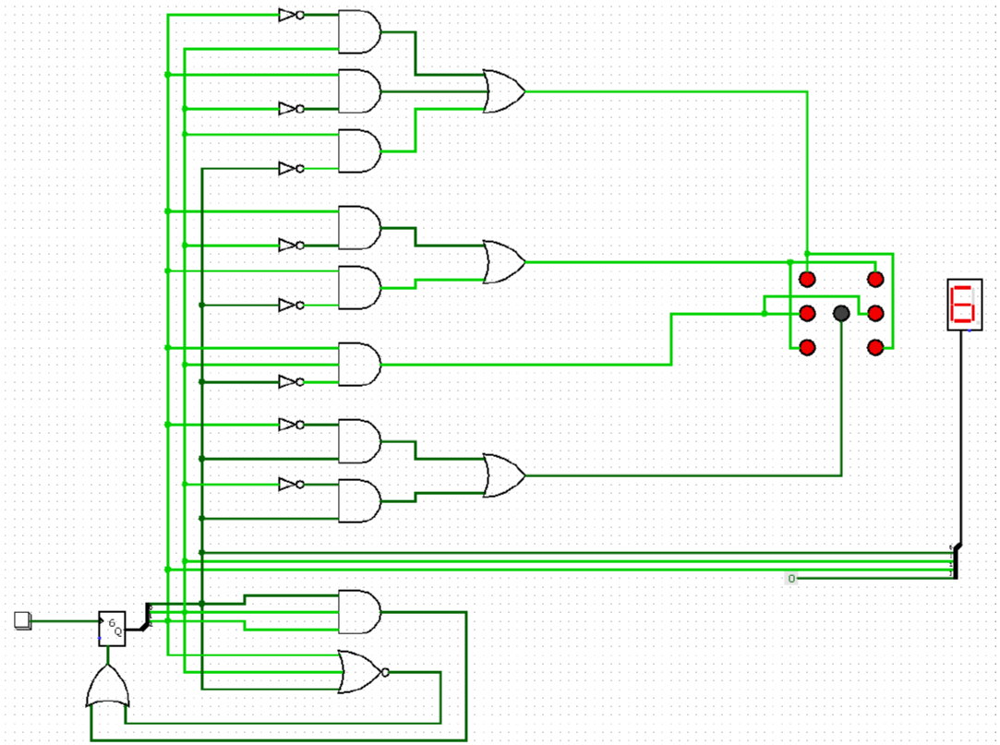
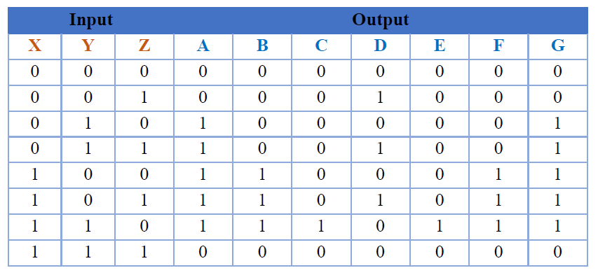

# 🎲 **Digital Dice Project**

> This project was created as part of my Digital Electronics Innovative Assignment in the 3rd semester.

---

## 📜 Project Description
> This project implements a **Digital Dice** using simple electronic components and logic gates. Instead of rolling a physical dice, the system electronically generates a random number between 1 and 6 and displays it on a **7-segment display**. The design incorporates **logic circuits, LEDs, and a push button** to create a reliable and fun digital dice simulation.

---

## 🎯 Project Aim
> The goal of this project is to create a **fair and reliable** electronic dice that removes any physical biases. It uses **LEDs and a 7-segment display** to ensure clear visibility of the rolled number.

---

## ❓ Problem Statement
> Traditional dice may produce biased results due to **uneven surfaces** or **worn-out dice**. This project eliminates such issues by implementing an **electronic dice**, ensuring **true randomness and accuracy**. It is compact, **easy to use**, and ideal for **board games, learning, and digital electronics experiments**.

---

## 🔩 Components Used
✅ **Push Button** – Triggers the dice roll.  
✅ **Random Number Generator** – Produces random values between 1 and 6.  
✅ **Logic Gates (AND, OR, NOT, NOR)** – Controls dice logic and ensures valid outputs.  
✅ **Splitter** – Distributes output signals.  
✅ **7 LEDs** – Displays dice-like patterns.  
✅ **Hex Digit Display** – Shows numerical dice value clearly.  

---

## 📥 Inputs and 📤 Outputs
### 🔹 Inputs
- 🎛️ **Button Press** – Initiates the dice roll.
- 🔗 **Logic Circuit** – Ensures output stays within 1 to 6.

### 🔸 Outputs
- 🔢 **7-Segment Display** – Displays the dice number (1-6).
- 💡 **LEDs** – Represent the dice face.

---

## ⚙️ How It Works
1️⃣ **Press the button** – Triggers the rolling process.  
2️⃣ **Random number generation** – Produces a number between **1 and 6**.  
3️⃣ **Logic circuit processes the output** – Ensures valid results.  
4️⃣ **LEDs light up** – Displays the corresponding dice pattern.  
5️⃣ **7-Segment display updates** – Shows the rolled number clearly.  

---

## 🛠️ Circuit Design
🔹 The circuit integrates the following components:  
✔️ **Push Button** – Initiates the rolling.  
✔️ **Random Number Generator** – Produces unpredictable values.  
✔️ **Logic Gates** – Ensures correct output range (1-6).  
✔️ **7-Segment Display** – Shows the dice value numerically.  

### 🖼️ Circuit Diagram:


---

## 📊 Truth Table


---

## 💡 LED Logic Expressions
Each LED is controlled using **Boolean expressions** derived from **Karnaugh Maps (K-maps)**. The K-map technique helps simplify the logic equations, ensuring minimal logic gate usage while maintaining accuracy in representing dice patterns.

---

## 🎮 Applications
✅ **Board Games** – Use as an electronic dice replacement.  
✅ **Education** – Demonstrates logic gate applications.  
✅ **Random Number Generation** – Ideal for other electronics projects requiring randomness.  

---

## 📂 Repository Structure
```bash
📁 Digital-Dice/
 ┣ 📜 Digital Dice.circ
 ┣ 📜 README.md
 ┣ 📜 Report.pdf
 ┣ 📜 circuit_diagram.png
 ┣ 📜 truth_table.png

```

---

## 📞 Contact
🔗 [LinkedIn](https://www.linkedin.com/in/akshat-jingar/)  
